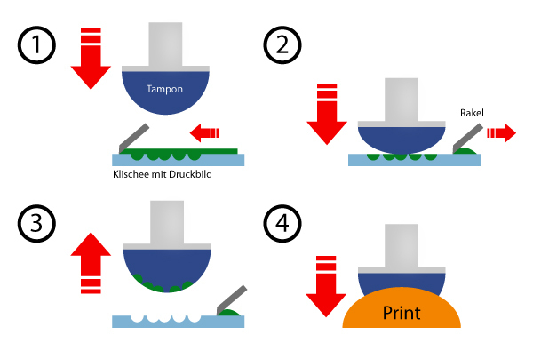
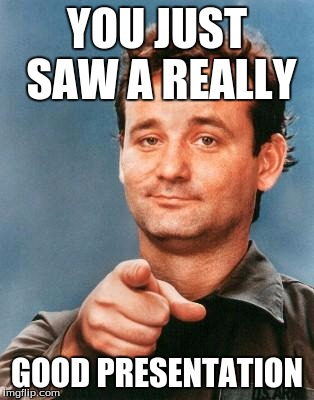

# Tiefdruck und Tampondruck

### Eine Präsentation von Jolene Müller, Katharina Meier, Sabrina Moselage, Chantal Rath, German Benske

---

## Tiefdruck

### Druckverfahren

 - Bebilderung der Druckplatte bzw. der Kupferschicht durch eine Stichel |
 - Druckform Zylinder wird komplett eingefärbt |
 - Eine Rakel streift die restliche Farbe ab |
 - Gegendruckzylinder presst Papier mit hohem Druck auf die Druckform und das saugfhähige Papier nimmt die Farbe auf |

---

---

## Tiefdruck

### Allgemeines

- Druckform: Stahlzylinder mit dicker Kupferschicht |
- Druckfarbe: dünnflüssig |
- Kennzeichen: bei Buchstaben können kleine Zacken am Rand entstehen |
- glatte Oberfläche, für große Auflagen |

---

## Tiefdruck

### Allgemeines

- zu druckenden Stellen = Näpfchen und nicht zu druckende Stellen = Stege |
- kann Halltöne durch unterschiedlich große Näpchen erzeugen |
- herkömmliches Druckverfahren  |
- direktes Druckverfahren |

---

## Tampondruck

### Druckverfahren

- Druckplatte wird seitenrichtig wie beim Tiefdruckverfahren eingefärbt |
- Tampon aus Silikon übernimmt die Farbe von der Druckplatte und überträgt sie auf den Bedruckstoff |
- Tampon passt sich an |

---

---

## Tampondruck

### Allgemeines

- Druckform: Auswaschplatten aus Metall |
- Druckfarbe: abstimmbar dünn - zäh |
- Kennzeichen: Tampon ist verformbar und scharfe, verzerrungsfreie Verformung |

---

## Tampondruck

### Allgemeines

- fast alle Materialien, in speziellen Druckereien, Spielwaren, Luftballons |
- indirektes Druckverfahren |

---

## Quellen
https://www.werbeartikel-discount.com/wissen/tampondruck/
http://blog.appl.de/das-tiefdruckverfahren/
https://Kompendium-der-Mediengestaltung.de

---

## Danke fürs Zuhören

